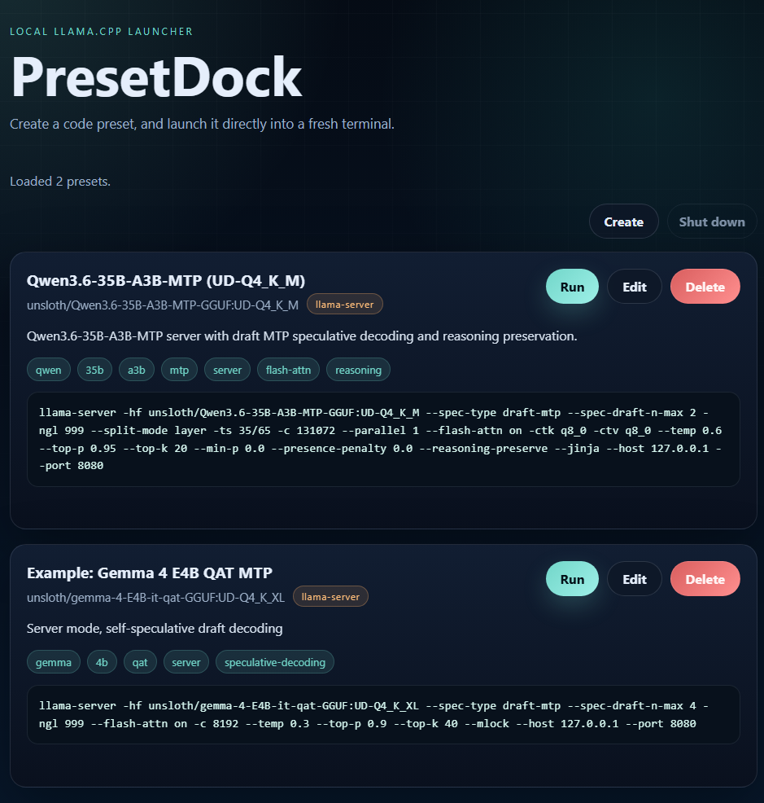

# PresetDock

PresetDock is a local-only Windows launcher and storage layer for llama.cpp command presets.

It is designed to keep your saved llama.cpp commands in plain JSON files, then expose them through a small browser UI so you can run, edit, create, or delete presets without copying commands in and out of a terminal.

	

This is not a general-purpose llama.cpp wrapper. Tools such as Ollama, LM Studio, Jan, KoboldCPP, and Open WebUI sit on top of model runtimes and provide broader orchestration, chat, or serving workflows. PresetDock is narrower: it keeps your own llama.cpp command lines organized and launchable, without replacing those runtimes or trying to manage models for you.

Preset files live in `presets/` next to the executable, and the filename is the preset id. The browser UI is just a front end over those files.

## Run

- Dev loop: `go run ./backend`
- Release build: `go build -ldflags "-H=windowsgui" -o PresetDock.exe ./backend`

## Presets

Preset JSON files live in `presets/` next to the executable. Each file name becomes the preset id, and the backend scans the folder fresh on every request.

The current JSON schema stores the human-facing fields only: `name`, `engine`, `model`, `tags`, `description`, and `command`. The `id` is derived from the filename, not stored in the JSON.

For build and implementation notes, see [docs/build-notes.md](docs/build-notes.md).
