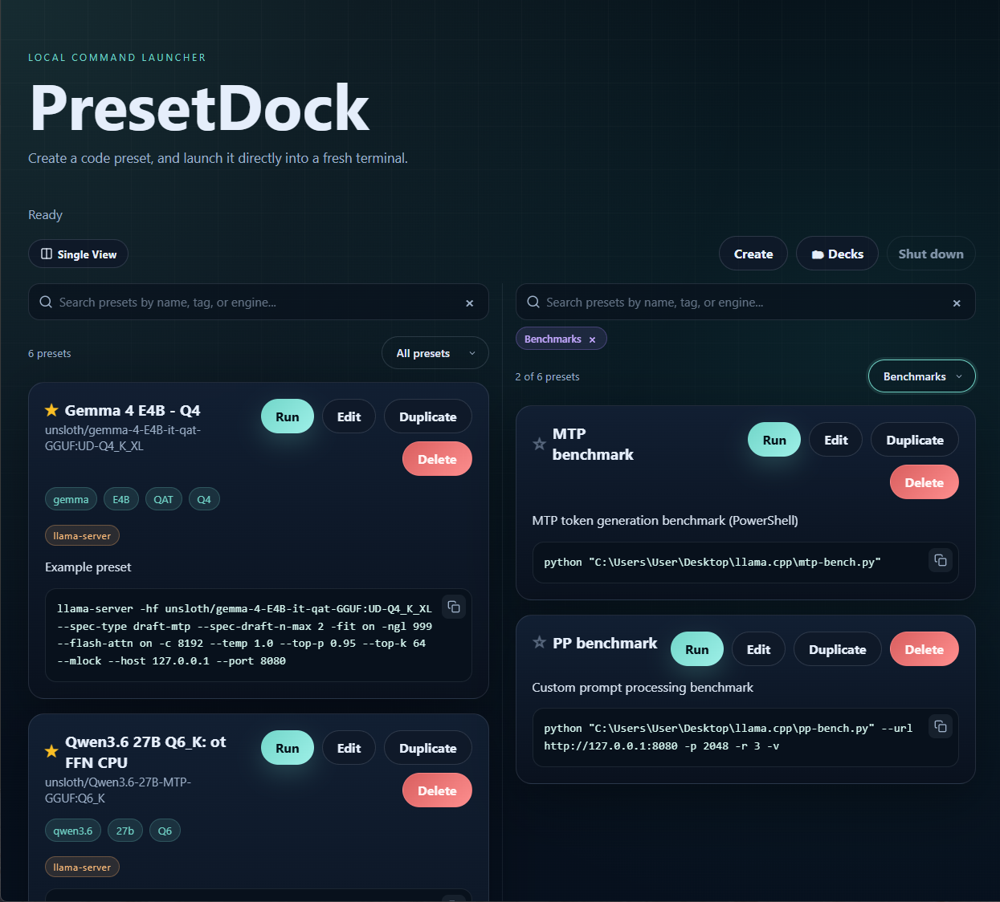

# PresetDock

PresetDock is a local-only Windows launcher and storage layer for command presets. Especially useful to store llama.cpp settings, and launch saved presets via Command Prompt or PowerShell.

> "A glorified text file to save your frequently used commands." - _SameSalamander5710, probably._

It is designed to keep saved commands in plain JSON files, then expose them through a small browser UI so you can create, edit, run, and save code presets without copying commands in and out of a terminal.

	

This is not a general-purpose llama.cpp wrapper. PresetDock simply keeps your own command lines organized and launchable.

Preset files live in `presets/` next to the executable. The browser UI is just a front end over those files.

## Installation

- Simply download and run the latest `PresetDock.exe` binary.

## Build

- Dev loop: `go run ./backend`
- Release build: `go build -ldflags "-H=windowsgui" -o PresetDock.exe ./backend`
- Running a preset opens a `cmd.exe` window and streams the command output there.

For build and implementation notes, see [docs/build-notes.md](docs/build-notes.md).
